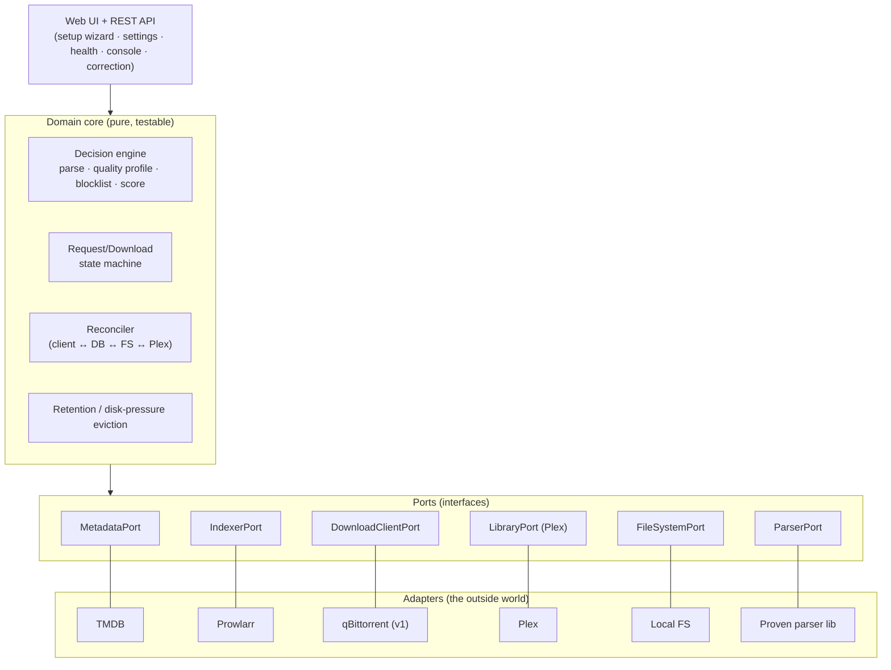
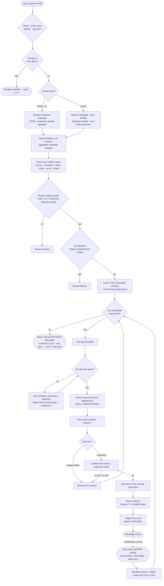
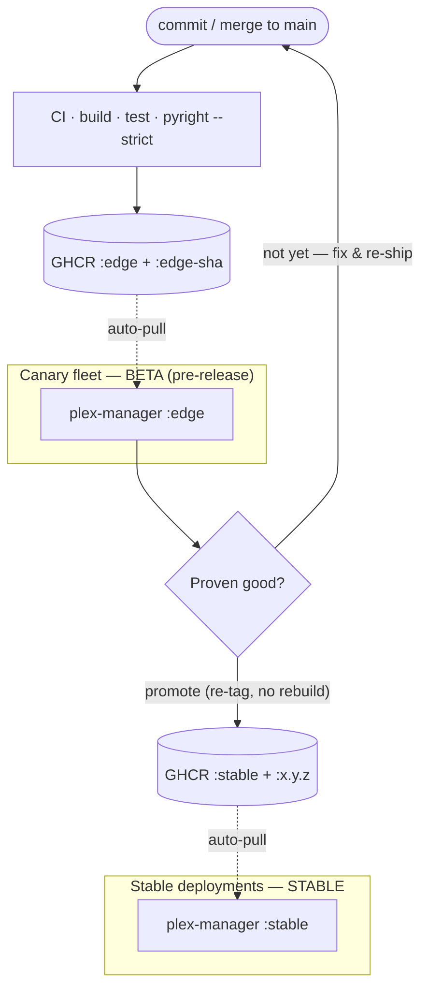

# Plex Manager v2 — Design Overview

- **Status:** Draft for review (brainstorming output)
- **Date:** 2026-06-29
- **Supersedes:** the `prototype/` FastAPI service (deployed as `plex-manager`)

> A self-hosted, unified media-request and automation service. It collapses the
> traditional `Overseerr → Radarr/Sonarr → Prowlarr → qBittorrent` stack into a
> single app — but, unlike the prototype, **every failure has an in-app
> correction path, and the proven release-parsing/quality logic is borrowed
> rather than reinvented.**

This document is the agreed design from the v2 brainstorming session. Each major
choice has a dedicated Architecture Decision Record under [`docs/adr/`](../adr/).
Detailed v1 feature scope is **finalized in the next session** ("the path toward
v1"); section 9 records the provisional cut.

---

## 1. Why v2

The prototype *worked* for the happy path. It failed at the **unhappy** path:

- It downloaded CAM / TELESYNC / TELECINE ("telecast"/webcam) releases despite
  trying not to, then marked them `downloaded`.
- Recovery from any bad state — wrong media, bad-quality file, qBittorrent ↔ DB
  drift, a full downloads disk — required SSH access to **delete files by hand,
  hand-edit the SQLite database, or manually clear qBittorrent.**
- There was no upgrade path for the schema (no migrations) and configuration
  lived in magic numbers and a hand-edited `.env`.

The root cause was twofold: **(a)** the app reinvented the *arr stack's
hardest-won logic (release parsing, quality profiles, blocklisting, import) and
got it wrong, and **(b)** failure had no escape hatch inside the product. v2 is
designed to fix both at the foundation.

## 2. Guiding principles (the north stars)

1. **Correction without a terminal.** Every failure mode that previously
   required SSH + manual DB/file surgery has a first-class, in-app correction
   path. The system reconciles its own state where it can; where it can't, it
   hands the operator a *button*, never a terminal. See [ADR-0005](../adr/0005-zero-terminal-web-operability.md).
2. **The release deployment is 100% web-operable.** On the `:stable` deployment
   (e.g. a non-technical operator's machine), the terminal is an **admin-only,
   install-time tool** — never required for use, configuration, recovery, or
   troubleshooting. The single honest exception is the one-time install.
3. **Honesty over silence.** States are surfaced, not swallowed. "No acceptable
   release found" is a real, visible, retryable status — not a silent `failed`.
   Secrets are never logged.
4. **Borrow proven brains.** We do not re-derive release parsing or quality
   ranking. We stand on a battle-tested parser and a Radarr-style quality-profile
   model. See [ADR-0001](../adr/0001-integrated-app-borrowed-brains.md).
5. **State is reconcilable, not scattered.** One reconciler owns the truth
   between the download client, the database, the filesystem, and Plex. State
   drift is healed automatically instead of becoming manual surgery.

## 3. Architecture at a glance

**Option C — an integrated app that owns the entire brain and delegates only the
bytes-over-the-wire download** to a pluggable download client (qBittorrent is the
v1 adapter). See [ADR-0001](../adr/0001-integrated-app-borrowed-brains.md) and
[ADR-0006](../adr/0006-download-client-port-qbittorrent.md).

The app is structured **ports-and-adapters (hexagonal)**: a pure domain core
(the decision engine, the request/download state machine, the reconciler) talks
to the outside world only through **ports** (interfaces), each satisfied by an
**adapter**. This is what makes the brain testable without the network and lets
qBittorrent be swapped without touching the core.

## 4. The request lifecycle

This is the agreed flow for *what happens when a user requests something*. The
red-equivalent steps (parse → quality profile → blocklist → validate → import)
are the "hard logic" we borrow brains for; the correction edges are the in-app
escape hatches the prototype lacked.

**State model (indicative).** `Requested → Searching → {NoAcceptableRelease |
Downloading} → {Failed→(blocklist)→Searching | Completed} → Validating →
{Invalid→(blocklist)→Searching | Importing} → Available`. Correction is a
first-class transition: `Available/Any → ReportIssue → (blocklist + purge) →
Searching`. The exact states/transitions are finalized when v1 is planned.

## 5. Subsystems

| Subsystem | Responsibility |
|---|---|
| **Discovery** | TMDB browse/search/detail; resolve canonical metadata; expand shows → seasons/episodes. |
| **Decision engine** | Borrowed parser → **ordered quality profile with a hard cutoff** (CAM/TS rejected, not merely down-ranked) → blocklist filter → scoring (incl. anime audio preference). |
| **Download orchestration** | `DownloadClientPort` (qBittorrent adapter); the **reconciler** keeps client ↔ DB ↔ FS ↔ Plex consistent; watch-aware disk-pressure eviction (evicts fully-watched, past-grace, unpinned library titles/seasons, not seeding torrents; see ADR-0012). |
| **Import** | Validate the file matches the expected media → rename to Plex conventions → route to Movies / TV / **Anime** root → trigger Plex scan. |
| **Correction & recovery** | Report-issue flow; manual re-search / force-grab / cancel / delete; blocklist management; automatic state-drift healing. |
| **Operability** | Web first-run **setup wizard**, **Settings UI** (no magic numbers), **health dashboard**, in-app **console/log viewer**. |
| **Persistence** | SQLite via typed SQLAlchemy 2.0, **Alembic migrations from day one**; designed so Postgres is a config swap. See [ADR-0007](../adr/0007-sqlite-alembic-migrations.md). |

## 6. Delivery: packaging, channels, deployment

Shipped as a **Docker image to GitHub Container Registry (GHCR)**; installed with
`docker compose up -d`. Automatic updates are an opt-in Compose profile backed
by a first-party updater sidecar. Plex Manager owns schedule/idle policy and a
database-backed drain lease; only the private, internally authenticated sidecar
receives Docker authority. See
[ADR-0003](../adr/0003-docker-ghcr-packaging.md),
[ADR-0004](../adr/0004-edge-stable-release-channels.md), and
[ADR-0024](../adr/0024-first-party-container-auto-updater.md).

Two channels, by image **tag**, with a **promotion gate**: the canary (beta)
fleet rides `:edge`; once a build proves itself, *you promote it by re-tagging the
exact same image (by reference) as `:stable` and the versioned `:x.y.z`* (no
rebuild), so stable deployments run a bit-identical artifact — including any
migration that already ran safely on the canary first.

Config and database live in a **mounted volume**, which persists them across
restarts and updates — the volume is not a backup. Every container start runs
`alembic upgrade head` before serving. When no migration ran between two
versions, rollback is re-pointing a tag; across a migration, rollback instead
means restoring the pre-migration backup (database + encryption key), then
running the older tag — see
[ADR-0023](../adr/0023-database-rollback-and-pre-migration-backup.md).

The opt-in updater keeps the previous image/container configuration until its
replacement is healthy. Moving tags offered to that updater have the stricter
ADR-0024 release contract: migrations must leave N-1 able to run against the
post-migration schema, so a failed startup can restore the retained N-1
image/configuration without Alembic downgrade. The pre-migration backup remains
the manual recovery unit for partially applied or incorrectly certified
migrations; the sidecar never claims to restore database bytes.

## 7. Technology stack

See [ADR-0002](../adr/0002-python-typed-stack.md).

- **Language:** Python 3.12+, **strictly typed** (`pyright --strict` in CI).
- **Web:** FastAPI + Pydantic v2.
- **Persistence:** SQLAlchemy 2.0 (typed) + Alembic; SQLite for v1, Postgres-ready.
- **Borrowed parser:** a proven release-name parser — candidate libraries
  `guessit`, `parse-torrent-title`/PTN, and `RTN` (parses *and* ranks).
  **Final selection is an evaluation task for the v1-planning session**; we do not
  hand-roll the parser.
- **Tooling:** `ruff` (lint + format + bandit `S` security rules), `pyright`,
  `pytest` (+ coverage), `pre-commit`.
- **Frontend:** intentionally **open** — server-rendered templates vs. a light
  SPA is a v1-planning decision. Whatever we pick must satisfy the
  web-operability principle (setup wizard, settings, health, console, correction).

## 8. Security posture

- Secrets (Plex token, API keys) **encrypted at rest** (the prototype's Fernet
  approach is carried forward) and **never written to logs** (a specific
  prototype regression we will guard against).
- CI security gates: **CodeQL** (SAST), **Dependabot** (dependency + Actions +
  base-image updates), **pip-audit** (dependency CVEs), **bandit** rules via
  `ruff`, **gitleaks** (secret scanning), **Trivy** (container image scanning).
- GitHub Actions version-pinned and updated by Dependabot; least-privilege
  `GITHUB_TOKEN` per workflow. SHA-pinning is a planned pre-public hardening step.
- Repo-level protections (secret-scanning push protection, required status
  checks, branch protection) are enabled as **settings** when the GitHub repo is
  created — tracked as a checklist in [`SECURITY.md`](../../SECURITY.md).

## 9. v1 scope (provisional — finalized next session)

v1 is the *complete request → watchable → self-correct loop, fully web-operable,*
and nothing more.

**In v1:** web setup wizard · Plex OAuth · TMDB discover/request (movie/show/
season/episode) · Prowlarr search · borrowed parser + quality profile + scoring ·
qBittorrent grab via the port · reconciler + state-drift healing · blocklist +
"no acceptable release" status · validate → rename → route (Movies/TV/Anime) →
Plex scan · **correction UI** (report-issue, re-search, force-grab, cancel,
delete, blocklist mgmt) · disk-full eviction · **Settings UI** · **health +
console** · Alembic · Docker/GHCR · edge/stable channels.

**Deferred to v1.1+:** policy-based retention BEYOND watch/grace disk-pressure
eviction (e.g. pure age cleanup, anime-specific policy) · notifications ·
auto-upgrade (1080p→4K, JP→dual-audio) · multi-user roles/approvals/quotas ·
calendar · watchlist sync · subtitles · additional download-client adapters ·
Postgres.

> **Open (parked) decision:** Watch-aware disk-pressure eviction (fully-watched +
> grace + pin) ships in v1 (see ADR-0012); a broader policy-based retention layer
> (arbitrary age/quota rules) remains parked for v1.1.

## 10. Non-goals (for now)

Re-implementing a general-purpose *arr replacement for arbitrary stacks; multi-
tenant SaaS; supporting download clients beyond the port's first adapter in v1;
non-Plex media servers.

## 11. Open questions for the v1-planning session

1. Retention in v1 vs v1.1 (see §9).
2. Final parser library selection (evaluate `guessit` / PTN / `RTN`).
3. Frontend approach (server-rendered vs light SPA).
4. State-machine states/transitions, finalized.
5. Quality-profile data model and defaults (resolutions, sources, cutoff).

## 12. Lessons carried from the prototype

| Prototype pain | v2 design response |
|---|---|
| CAM/telecast grabs | Ordered quality profile with a **hard cutoff** + borrowed parser. |
| Re-grabbing the same bad release | **Blocklist** feeds the retry; pick the *next* best. |
| qBittorrent ↔ DB drift (`torrents_info` errors) | Single **reconciler** owns cross-system truth. |
| Manual SQLite/file surgery | **In-app correction** flows; zero-terminal operation. |
| No schema upgrade path | **Alembic migrations from day one.** |
| Magic numbers / hand-edited `.env` | **Web setup wizard + Settings UI.** |
| Full downloads disk halts everything | **Disk-pressure eviction** in the download path. |
| Silent `failed` states | **Surfaced, retryable statuses.** |
| Secrets leaked to logs | Redaction + secrets never logged, enforced in review. |
